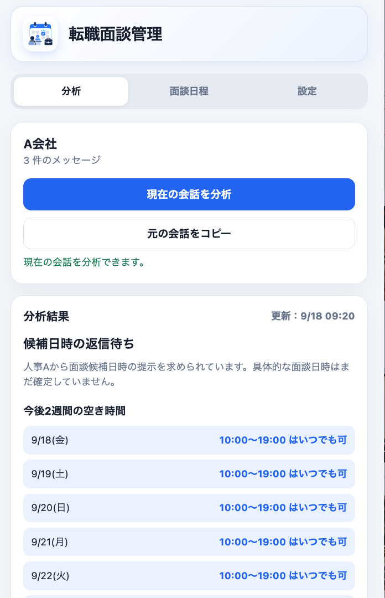
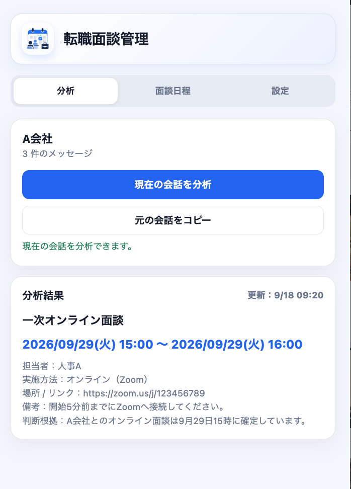
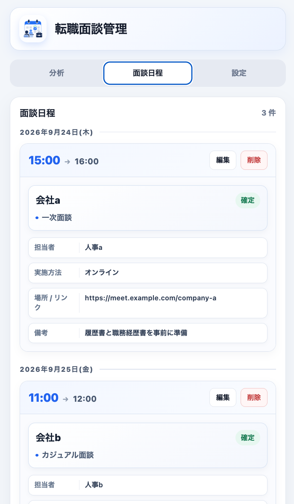
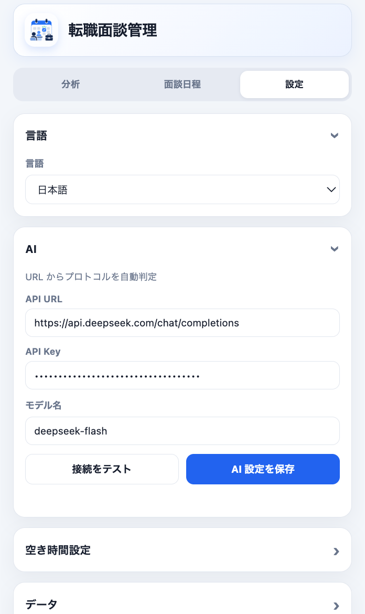

<h1>
  
  転職面談管理
</h1>

Findy と BizReach の採用担当者との会話を AI で整理し、確定した面談日時や、返信が必要な候補日時をすぐ確認できる Chrome 拡張機能です。

会話を読み返して予定を手作業で整理する時間を減らし、面談対応に集中することを目的としています。

## 更新履歴

| 日付 | 種別 | 内容 |
| --- | --- | --- |
| 2026-09-23 |  | 面談日程から求人ページと会話ページを開けるようにした |
| 2026-09-23 |  | 分析失敗の表示と、同じ会話のメッセージ重複保存を修正 |
| 2026-09-21 |  | BizReach の会話ページに対応 |

## 主な機能

- **Findy と BizReach に対応**：両方の採用担当者との会話ページを読み取り、同じ流れで分析と面談日程の管理ができます。
- **現在の会話を分析**：開いている会話全文を取得し、会社名とメッセージ数を表示します。分析対象は「元の会話をコピー」で取得できる内容と同一です。
- **確定した面談を抽出**：最新の確定面談について、日時、担当者、実施方法、場所・URL、備考、判断根拠を1枚のカードにまとめます。
- **仮予定を確保**：企業が提示した具体的な日時を候補者が1つ選んで返信した場合、企業からの確定返信前でも「仮予定」として面談日程に保存します。後から同じ面談が確定すると既存の日程を更新します。
- **候補日時の返信を補助**：企業から候補日時の提示を求められた場合、今後2週間の空き時間を表示します。保存済みの面談と、その前後に設定した余裕時間、日本の土日祝日を自動的に除外します。
- **空き時間を自分で確認**：「空き時間」タブではローカルデータから面談日程を読み直して空き時間を更新し、候補時間を選択してコピーできます。設定した面談時間と候補数を使い、確定・仮予定の面談時間とその前後の余裕時間を除外します。
- **面談日程を一覧管理**：確定・仮予定の面談を日付順に表示し、日時やタイトルの編集、不要な予定の削除ができます。
- **日本語・英語・中国語に対応**：画面表示だけでなく、AI に送る指示と分析結果の言語も選択した言語に合わせます。
- **バックグラウンド分析**：分析開始後にポップアップを閉じても処理状態は保存され、再度開いたときに結果を確認できます。
- **ローカルデータの書き出しと読み込み**：面談日程、分析結果、設定などのローカルデータを JSON ファイルとして書き出せます。読み込むと現在のローカルデータと設定が上書きされます。

## 画面

### 分析

<table>
  <tr>
    <td align="center"><strong>確定面談</strong></td>
    <td align="center"><strong>候補日時の返信待ち</strong></td>
  </tr>
  <tr>
    <td></td>
    <td></td>
  </tr>
</table>

### 面談日程と設定

<table>
  <tr>
    <td align="center"><strong>面談日程</strong></td>
    <td align="center"><strong>設定</strong></td>
  </tr>
  <tr>
    <td></td>
    <td></td>
  </tr>
</table>

## インストール

現在は Chrome ウェブストア未公開のため、ローカルから読み込みます。

1. このリポジトリをダウンロードまたはクローンします。
2. Chrome で `chrome://extensions/` を開きます。
3. 右上の「デベロッパー モード」を有効にします。
4. 「パッケージ化されていない拡張機能を読み込む」を選択します。
5. このリポジトリのフォルダーを指定します。
6. ツールバーから「転職面談管理」をピン留めします。

更新後は `chrome://extensions/` にある本拡張機能の「更新」ボタンを押してください。

## 初期設定

拡張機能を開き、「設定」タブで次の項目を設定します。

### 1. 言語

日本語、English、中文から選択します。日本語を選ぶと、AI への指示と分析結果も日本語になります。

### 2. AI

| 項目 | 内容 |
| --- | --- |
| API URL | 利用する AI サービスの API エンドポイント |
| API Key | AI サービスから発行された API キー |
| モデル名 | 利用するモデルの正式なモデル ID |

設定例：

| サービス | API URL |
| --- | --- |
| OpenAI | `https://api.openai.com/v1/chat/completions` |
| Anthropic | `https://api.anthropic.com/v1/messages` |
| DeepSeek | `https://api.deepseek.com/chat/completions` |
| OpenAI 互換 API | 各サービスが案内する `/chat/completions` エンドポイント |

URL から OpenAI Chat Completions 形式または Anthropic Messages 形式を自動判定します。入力した API URL のドメインに初めて接続する場合は、Chrome のアクセス許可が表示されます。

### 3. 空き時間

- **毎日の開始時刻／終了時刻**：候補として提示できる時間帯
- **面談時刻の前後に空ける時間**：保存済み面談の前後を候補から除外する分数

初期値は 10:00〜19:00、前後60分です。設定セクションの開閉状態も保存されます。

## 使い方

1. Findy または BizReach で分析したい企業との会話ページを開きます。
2. Chrome のツールバーから本拡張機能を開きます。
3. 表示された会社名とメッセージ数を確認します。
4. 「現在の会話を分析」を押します。
5. 「分析結果」で最新の確定面談、または候補日時の提示依頼を確認します。
6. 確定面談は「面談日程」タブに保存されます。

「元の会話をコピー」を押すと、AI 分析に使用するものと同じ会話全文をクリップボードへコピーできます。

## データと安全性

- 本拡張機能専用の外部サーバーは使用しません。
- API キー、取得したメッセージ、分析結果、面談日程、設定は Chrome 拡張機能のローカルストレージに保存されます。
- 「現在の会話を分析」を押したときだけ、現在の会話全文と分析指示を、設定した AI API URL へ送信します。
- 候補日時から日本の祝日を除外するため、対象年だけを Japanese Calendar API（`api.jp-calendar.com`）へ問い合わせます。会話や個人情報は送信しません。
- API キーは設定した AI API への認証にだけ使用します。信頼できる API URL を設定してください。
- 閲覧履歴全体は収集せず、拡張機能を開いた時点のアクティブな Findy または BizReach の会話ページを読み取ります。
- カスタム API URL へのアクセス権限は、その URL を保存するときに Chrome から確認されます。
- 「データを書き出す」では、メッセージ、分析結果、面談日程、設定を JSON ファイルとして保存できます。
- 「データを読み込む」では、本拡張機能から書き出した JSON ファイルを取り込み、現在のローカルデータと設定を上書きします。
- 「ローカルデータを消去」では、メッセージ、分析結果、面談日程を削除し、各種設定は保持します。すべてのローカルデータを削除する場合は、Chrome から拡張機能を削除してください。

API キーはローカルに保存されますが、暗号化保管ではありません。共有端末では使用せず、AI サービス側でも利用上限や請求上限を設定してください。送信した会話の取り扱いは、利用する AI サービスのプライバシーポリシーに従います。

## 対応範囲

- Chrome Manifest V3
- Findy の会話ページ
- BizReach の会話ページ（`/messages/{ID}`）
- OpenAI Chat Completions 互換 API
- Anthropic Messages API

## テスト

```bash
node --test popup.test.js
```
